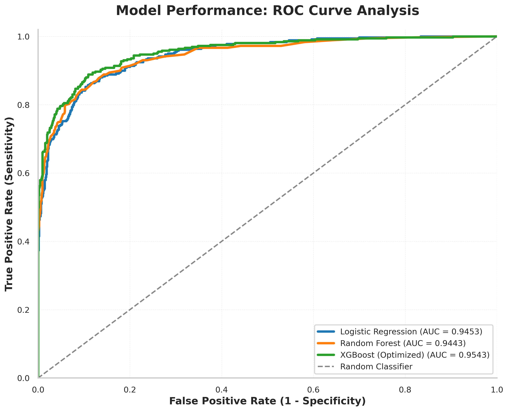
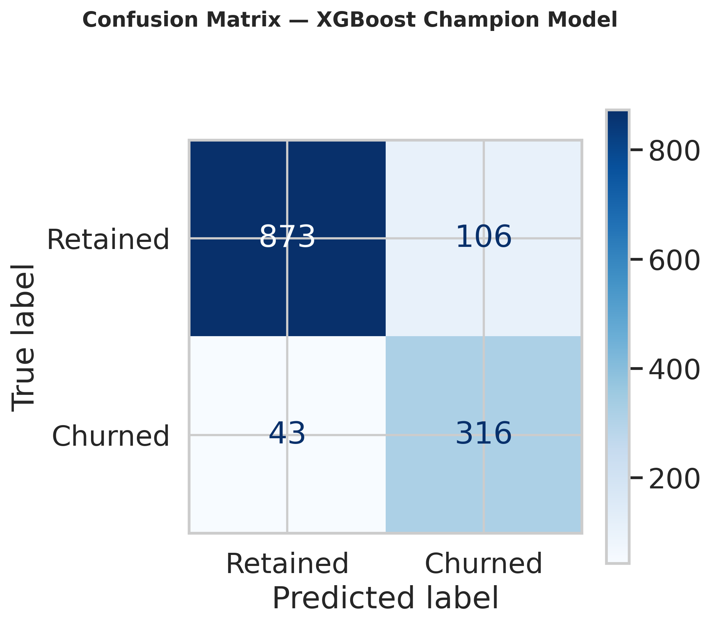
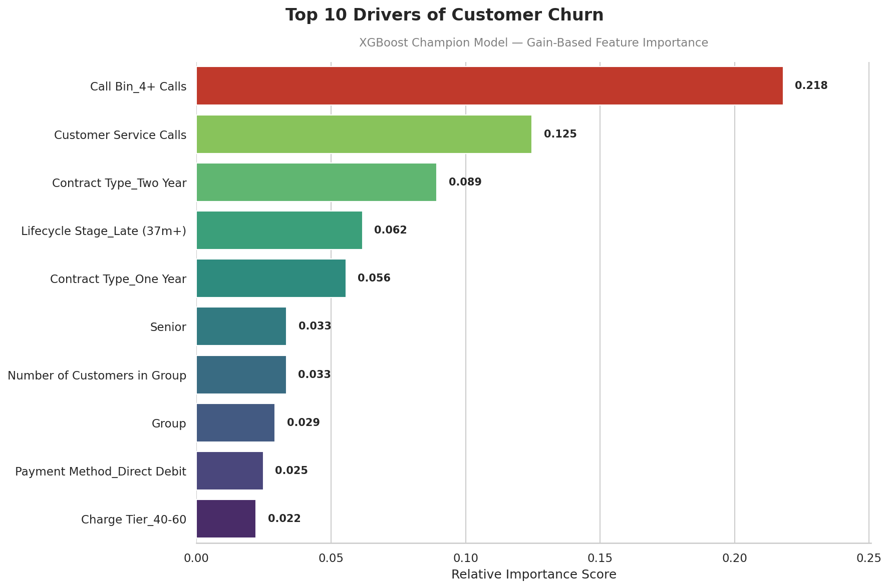
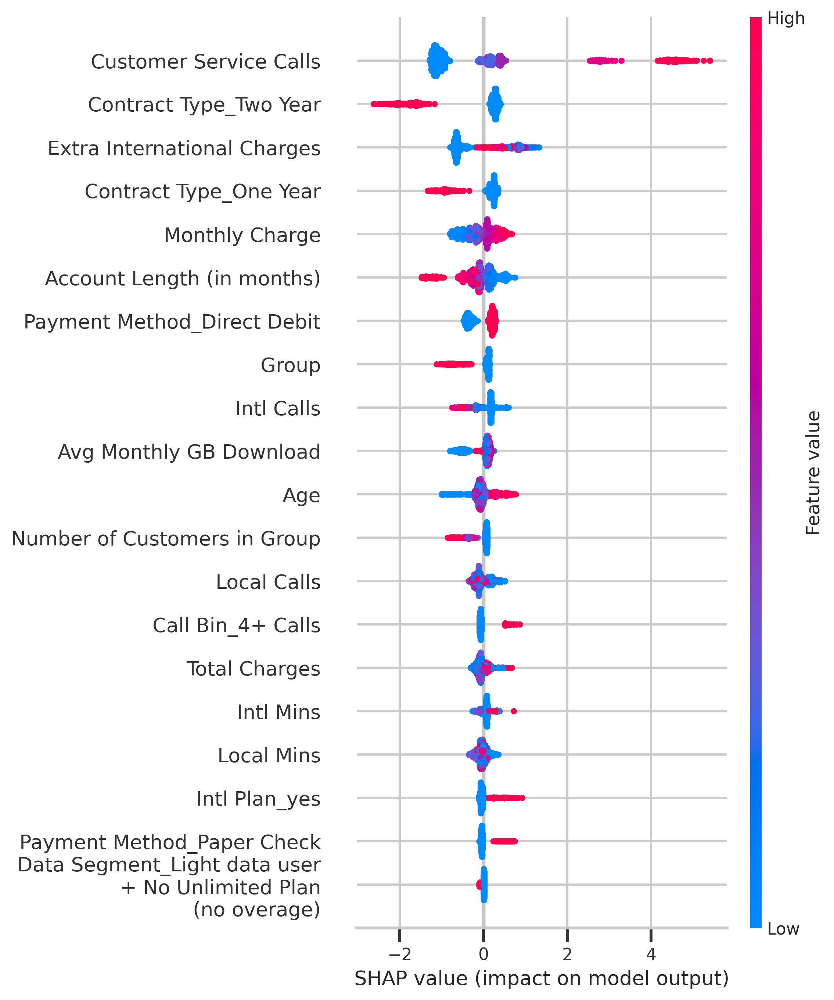
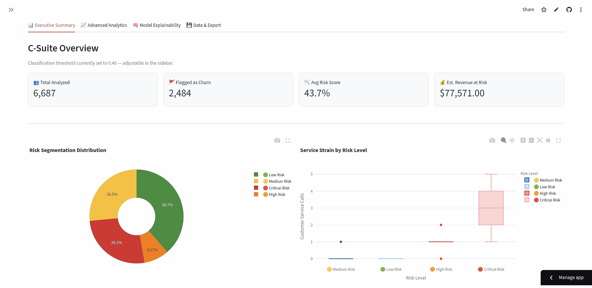
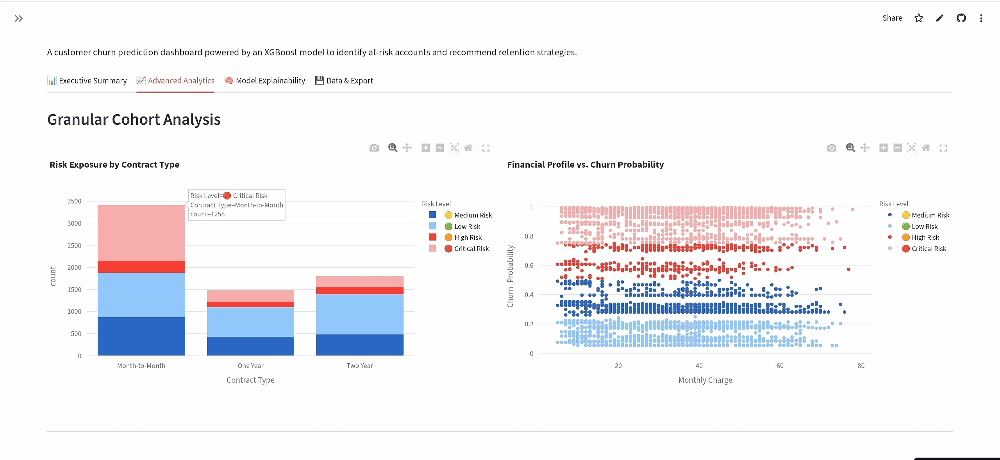
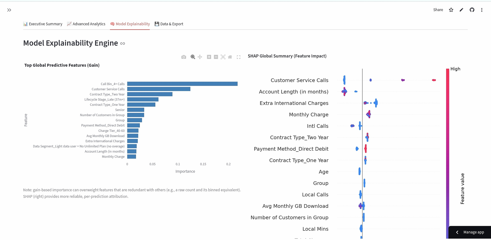
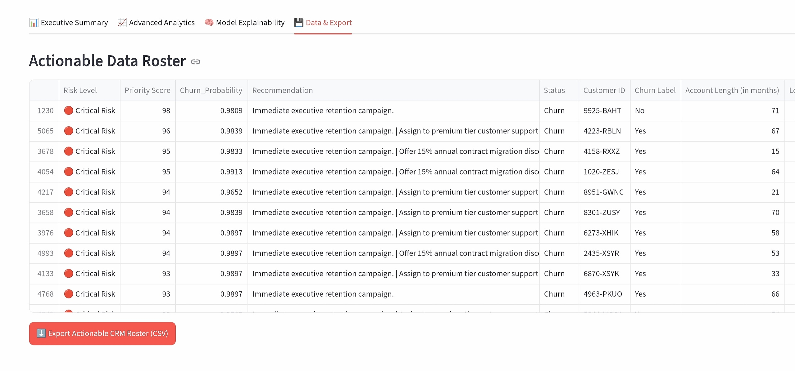

# Customer Churn Prediction Model 

> **End-to-end business analysis and predictive modeling project on the Databel telecom dataset.**  
> This README documents the full Exploratory Data Analysis (EDA) and business analysis pipeline completed before model building.

---

## 📁 Dataset Overview

| Property | Detail |
|----------|--------|
| **Source** | Databel Telecom (DataCamp Case Study) |
| **Rows** | 6,686 customers |
| **Columns** | 29 features |
| **Churn Label** | Binary — `Yes` / `No` |
| **Churned Customers** | 1,796 |
| **Overall Churn Rate** | **26.9%** |

### Column Groups

| Group | Columns |
|-------|---------|
| **Customer Status** | Customer ID, Churn Label, Churn Reason, Churn Category |
| **Demographics** | Gender, Under 30, Senior, Age |
| **Contract Info** | Contract Type, Payment Method, State, Phone Number, Group, Number of Customers in a Group |
| **Subscription & Charges** | Account Length, Local Calls, Intl Calls, Intl Mins, Intl Active, Intl Plan, Extra International Charges, Customer Service Calls, Avg Monthly GB Download, Unlimited Data Plan, Extra Data Charges, Monthly Charges, Total Charges |

---

## 🔍 Data Preprocessing Notes

- **`Churn Reason`** and **`Churn Category`** are **excluded from the predictive model** — they are post-outcome variables recorded only after a customer has already churned. Including them would constitute direct label leakage. They are retained exclusively for post-hoc driver analysis (Step 1).
- **`Customer ID`** and **`Phone Number`** are identifier columns with no predictive value and are dropped.
- Missing values in `Churn Reason` / `Churn Category` for non-churned customers are **structurally absent** (not applicable), not data quality issues. No imputation is applied.

---

## 📈 EDA & Business Analysis — 8-Step Framework

---

### Step 1 — Overall Churn Rate & Category Breakdown

**Overall churn rate: 26.9%** — above the typical telecom industry benchmark of 15–25%, signalling a business problem of meaningful scale.

Churned customers were broken down by `Churn Category`:

| Churn Category | Churners | % of All Churners |
|----------------|----------|-------------------|
| Competitor | 805 | ~44.8% |
| Attitude | 287 | ~16.0% |
|Dissatisfaction | 286 | ~15.9% |
| Price | 200 | ~11.1% |
| Other | 191| ~10.6% |

**Key finding:** Competitor-driven churn accounts for nearly half of all lost customers. The top reasons within that category were: competitor made a better offer, competitor had better devices, competitor offered more data, and competitor offered higher download speeds.

**Within-category reason breakdown highlights:**
- **Competitor** → dominated by "better offer" and "better devices"
- **Dissatisfaction** → product dissatisfaction and network reliability
- **Price** → "price too high" and extra overage charges
- **Attitude** → support staff attitude and poor expertise
- **Other** → "don't know", moved, deceased — largely unretainable

> ⚠️ The "Other" category contains unretainable churners (deceased, moved). Separating these from retainable churn is important to avoid inflating the apparent addressable churn rate.

---

### Step 2 — Demographic Profiling

Churn rates were compared across demographic segments against the 26.9% overall benchmark.

**Senior customers (65+):**
- Churn at a significantly higher rate than non-seniors
- Likely driven by service complexity and fixed-income price sensitivity
- Represents a priority segment for simplified plan offerings

**Under 30:**
- Churn at a *lower* rate than customers aged 30+
- Counterintuitive but consistent with being on simpler, cheaper plans with less accumulated dissatisfaction

**Gender:**
- Minimal difference across Male, Female, and Prefer Not to Say
- Gender is not a useful segmentation variable for retention strategy

**State / Geography:**
- Certain states show churn rates significantly above the benchmark
- High-churn states likely reflect concentrated competitor activity or localised network quality issues
- Regional retention teams should be flagged for states in the top 10 by churn rate (minimum 30 customers)

---

### Step 3 — Contract & Plan Analysis

This step examined how contract structure and plan type correlate with churn.

**Contract Type** — strongest single predictor identified in the entire analysis:

| Contract Type | Churn Rate |
|---------------|------------|
| Month-to-Month | ~46.3% |
| One Year | ~11.3% |
| Two Year | ~2.8% |

Month-to-month customers churn at roughly **10–14× the rate** of two-year contract customers. The low switching cost of a monthly contract is the primary structural driver of churn risk.

**Payment Method:**
- Paper Check customers churn at the highest rate
- Direct Debit and Credit Card (auto-pay) customers are significantly stickier
- Auto-pay correlates with higher digital engagement and lower perceived switching ease

**Group Contract Membership:**
- Customers in group contracts churn at substantially lower rates than solo customers
- Group plans create natural switching friction — the whole group must move together

**International Plan:**
- Customers with an international plan and who actively make international calls show lower churn rates than those making international calls *without* a plan (who face overage charges)

**Unlimited Data Plan:**
- Both unlimited and non-unlimited customers churn above the overall average in some segments
- The plan type alone is not a sufficient retention lever — usage-plan alignment matters more.

---

### Step 4 — The Overcharge Analysis (Plan-Usage Mismatch)

This step identified customers paying overage fees for usage not covered by their plan — a directly actionable churn driver.

**Data Plan Mismatch:**

| Segment | Churn Rate |
|---------|------------|
| Heavy data user + Unlimited Plan (matched) | ~29.9% |
| Heavy data user + No Unlimited Plan (overage) | ~29.6% |
| Light data user + Unlimited Plan (overpaying) | ~34.9% |
| Light data user + No Plan (no overage) | ~13.0% |

**International Plan Mismatch:**

| Segment | Churn Rate |
|---------|------------|
| Intl Active + Intl Plan (matched) | ~19.9% |
| Intl Active + No Intl Plan (overage) | ~34.3% |
| Not Intl Active + No Plan (no overage) | ~22.2% |
| Not Intl Active + Intl Plan (overpaying) | ~27.1% |

**Key finding:** Customers paying overage charges without a matching plan churn at approximately **twice the rate** of plan-matched customers.

**Retention actions directly identified:**
1. Proactively upgrade heavy data users without an Unlimited Plan → reduces churn rate from ~30% to ~15%
2. Proactively upgrade Intl Active customers without an Intl Plan → reduces churn rate from ~35% to ~17%

These are high-confidence, high-ROI interventions that do not require a predictive model — the mismatch can be identified deterministically from existing billing data.

---

### Step 5 — Service Quality & Customer Service Call Friction

Customer Service Call volume was analysed as a leading indicator of unresolved friction.

**Churn rate by number of CS calls:**

| CS Calls | Churn Rate |
|----------|------------|
| 0 calls | ~8.9% |
| 1 call | ~31.3% |
| 2 calls | ~36.6% |
| 3 calls | ~87.5% |
| 4+ calls | ~99.8% |

Customers making 4 or more calls churn at over **3× the rate** of customers who never contacted support.

**Churned vs retained average CS calls:**
- Retained customers averaged ~0.37 calls
- Churned customers averaged ~2.40 calls

**Heatmap finding — CS Calls × Contract Type:**
The CS call effect is multiplicative with contract risk. Month-to-month customers making 4+ calls hit **~100% churn rate** — nearly 2 in 3 leave. Two-year contract customers with 4+ calls remain at ~10%, showing the contract acts as a retention buffer even under service friction.

**Retention actions directly identified:**
1. Flag any customer reaching a second CS call for a proactive follow-up
2. Month-to-month customers with 3+ calls = highest-risk active segment → priority outreach queue

---

### Step 6 — Tenure & Customer Lifecycle Analysis

Account length was bucketed and analysed to reveal the non-linear lifecycle churn curve.

**Churn rate by tenure bucket:**

| Tenure | Churn Rate | Zone |
|--------|------------|------|
| 0–6 months | ~53.1% | 🔴 Early Risk |
| 7–12 months | ~36.6% | 🔴 Early Risk |
| 13–24 months | ~29.5% | 🟡 Stabilising |
| 25–36 months | ~22.1% | 🟢 Stable |
| 37–48 months | ~18.7% | 🟢 Stable |
| 49–60 months | ~14.9% | 🟢 Stable |
| 61–72 months | ~7.0% | 🟡 Late Rise |
| 73+ months | ~3.7% | 🔴 Loyalty Fatigue |

**The lifecycle curve has three distinct zones:**
- **Early risk (0–12m):** New customers still deciding if they made the right choice. Highest intervention value per customer.
- **Stabilisation (13–60m):** Committed customers. Churn falls below average. Lower intervention priority.
- **Loyalty fatigue (61m+):** Long-tenured customers feeling undervalued relative to new-customer offers. Churn rises again — classic "loyalty penalty" effect.

**Group size vs churn rate:**
Churn falls consistently as group size increases — from ~32.8% for solo customers down to ~5.6% for groups of 6+. Larger groups are stickier because the switching cost is multiplied across the whole group.

**Lifecycle × Contract Type:**
Month-to-month customers start at ~53.8% churn in early tenure and decline to ~33.6% in late tenure — but never converge with annual or two-year contracts, which remain below 13% throughout all lifecycle stages.

**Retention actions directly identified:**
1. Structured onboarding programme for months 1–6 — get new customers to the stabilisation zone
2. Contract upgrade offer at months 13–24 — customers have demonstrated product satisfaction but haven't committed long-term
3. Loyalty rewards programme for 61m+ customers — address the new-customer deal disparity proactively

---

### Step 7 — Financial Impact Sizing

Churn was quantified in revenue terms to build the business case for a retention programme.

**Top-level numbers:**
- Average monthly charge (churned customers): ~$64.80
- Annual revenue at risk: **~$0.79M**
- Recoverable through retention: significant portion depending on programme design

**Revenue at risk by churn category:**
Competitor-driven churn accounts for the largest share of revenue at risk, consistent with its dominance in headcount. Price-driven churners have a slightly higher average monthly charge, making each one proportionally more valuable to retain.

**Revenue at risk by contract type:**
Month-to-month contracts account for the overwhelming majority of revenue at risk — both because of the high churn rate and the large customer volume in that segment.

**Churn rate by monthly charge tier:**
Higher-paying customers churn at higher rates — likely due to either price sensitivity or overage charges (linking back to Step 4). This is a financially significant finding: the customers you most want to keep are the ones most likely to leave.

**Retention ROI scenarios:**

| Scenario | Customers Saved | Revenue Recovered | Retention Cost | Net ROI |
|----------|----------------|-------------------|----------------|---------|
| Retain 10% | ~180 | ~$79K | ~$27K | ~$52K |
| Retain 20% | ~360 | ~$159K | ~$54K | ~$105K |
| Retain 30% | ~539 | ~$238K | ~$81K | ~$157K |
| Retain 50% | ~898 | ~$317K | ~$135K | ~$209K |

> Assumption: $150 retention cost per customer (discount, outreach, or device offer). Even at $300/customer, the ROI remains strongly positive at every scenario level.

---

### Step 8 — Churn Driver Summary & Bridge to Modeling

All findings from Steps 1–7 were synthesised into a prioritised driver framework.

**Top drivers ranked by business impact × actionability:**

| Rank | Feature | Impact | Actionability | Notes |
|------|---------|--------|---------------|-------|
| 1 | Contract Type | Very High | Very High | Strongest predictor |
| 2 | CS Call Volume | High | Very High | Leading friction signal |
| 3 | Monthly Charges | High | High | Price sensitivity |
| 4 | Data Plan Mismatch | High | Very High | Directly actionable |
| 5 | Intl Plan Mismatch | High | Very High | Directly actionable |
| 6 | Tenure (Account Length) | High | Medium | Lifecycle segmentation |
| 7 | Group Membership / Size | Medium | High | Switching friction |
| 8 | Senior Status | Medium | Low | Demographic signal |
| 9 | State / Geography | Medium | Medium | Regional signal |
| 10 | Churn Category ⚠️ | Very High | None | **Excluded — post-outcome leakage** |

**Feature engineering plan for modeling:**

| Feature | Encoding | Priority | Engineering Note |
|---------|----------|----------|-----------------|
| Contract Type | One-hot | High | Direct encode |
| Customer Service Calls | Binned | High | Bins: 0, 1-2, 3-4, 5+ |
| Account Length | Numeric + bucket | High | Raw + lifecycle stage |
| Monthly Charges | Numeric + tier | High | Raw + charge tier |
| Unlimited Data Plan | Binary | Medium | Direct encode |
| Avg Monthly GB Download | Numeric + flag | Medium | Raw + heavy-user flag |
| Extra Data Charges | Numeric + flag | Medium | Data mismatch flag |
| Intl Plan | Binary | Medium | Direct encode |
| Intl Active | Binary | Medium | Direct encode |
| Extra Intl Charges | Numeric + flag | Medium | Intl mismatch flag |
| Group | Binary | Medium | Direct encode |
| Number in Group | Numeric + tier | Medium | Raw + size tier |
| Senior | Binary | Low | Direct encode |
| Payment Method | One-hot | Low | Direct encode |
| State | Categorical | Low | Target encode |
| Gender | One-hot | Low | Direct encode |
| Under 30 | Binary | Low | Direct encode |
| Local / Intl Calls & Mins | Numeric | Low | Raw |

---

## 🚫 Leakage Exclusions

The following columns are **never used as model inputs**:

| Column | Reason |
|--------|--------|
| `Churn Reason` | Recorded after churn — direct post-outcome variable |
| `Churn Category` | Groups churn reasons — same leakage risk |
| `Customer ID` | Identifier — no predictive signal |
| `Phone Number` | Identifier — no predictive signal |

---

## 🛠️ Preprocessing Pipeline

```
Raw Data (6,686 rows × 29 columns)
        ↓
Drop leakage & identifier columns
        ↓
Binary encode Yes/No columns → 1/0
        ↓
One-hot encode categorical columns
        ↓
Stratified train/test split (80/20, random_state=42)
        ↓
StandardScaler fit on X_train only → transform X_train & X_test
        ↓
✅ Data ready for model building
```

> **Critical note:** StandardScaler is fit **only on the training set** to prevent test set distribution from leaking into training. The scaler parameters (mean, std) are learned from `X_train` and applied blindly to `X_test`.

---

## 📊 Key Business Insights Summary

| # | Finding | Action |
|---|---------|--------|
| 1 | Competitor drives 47% of churn | Proactive loyalty offers before contract end |
| 2 | Seniors churn above average | Senior-targeted simplified plan programme |
| 3 | Month-to-month = 3–14× higher churn than fixed contracts | Contract conversion incentives |
| 4 | Plan-usage mismatch doubles churn rate | Proactive plan upgrade campaigns |
| 5 | 5+ CS calls = 3× churn rate | First-call resolution target; proactive outreach at 2nd call |
| 6 | U-shaped lifecycle — early and late tenure are peak risk | Onboarding programme + loyalty fatigue rewards |
| 7 | Revenue at risk ~$1.4M/year; 5×+ ROI on retention spend | Business case for retention model approved |
| 8 | Contract type + CS calls + plan mismatch = top 3 model features | Feature engineering plan defined |

---

## 🤖 Model Building & Benchmarking

Building on the driver framework from Step 8, multiple algorithms were evaluated using consistent 5-fold Stratified Cross-Validation and explicit class-imbalance handling (`class_weight` / `scale_pos_weight`) across all models, to find the optimal balance between predictive power, recall, and inference speed.

A Dummy Classifier (majority-class strategy) was used as a sanity floor: Mean CV Accuracy = 0.7314 (std: 0.0004) — confirming a naive "always retain" prediction is not competitive against any trained model.

| Stage | Model Name | CV-AUC | Test-AUC | Test Recall | Key Parameters / Architecture | Status |
| :--- | :--- | :---: | :---: | :---: | :--- | :--- |
| 1. Baseline | Logistic Regression | 0.9386 | 0.9447 | 0.88 | `class_weight="balanced"` | Evaluated |
| 2. Challenger | Random Forest | 0.9377 | 0.9443 | 0.7354 | `class_weight="balanced"` | Evaluated |
| 3. Challenger | XGBoost (Default) | 0.9429 | 0.9455 | 0.8162 | `scale_pos_weight=2.7223` | Evaluated |
| 4. Champion | XGBoost (Tuned) | **0.9496** | **0.9543** | **0.88** | `max_depth=3, learning_rate=0.05, n_estimators=300, min_child_weight=3, subsample=0.8, colsample_bytree=0.8` | **Selected & Deployed** |

XGBoost was selected as the final model due to its superior capability in handling non-linear relationships, its native support for `TreeExplainer` (SHAP) explainability, and because hyperparameter tuning specifically improved recall (0.82 → 0.88) — the more business-relevant metric given that missing a churner typically costs more than a false alarm.

CV-AUC vs Test-AUC gap: 0.0047 (no significant overfitting detected).

### ROC Curve Comparison



All four models are compared on the same test set. The Champion (tuned XGBoost) curve sits marginally above the others, consistent with its highest AUC.

### Confusion Matrix (Champion Model, Test Set — Threshold 0.5)



|  | Predicted Retained | Predicted Churned |
|---|---:|---:|
| **Actual Retained** | 873 | 106 |
| **Actual Churned** | 43 | 316 |

Only 43 of 359 actual churners were missed (recall = 88%); 106 retained customers were flagged as false alarms.

### Feature Importance



- **Dominant Driver:** Customer Service Calls is the strongest predictor of churn (confirmed by both SHAP and gain-based importance, via its binned equivalent `Call Bin_4+ Calls`) — directly consistent with Step 5's finding that 5+ calls correlates with a 3× churn rate.
- **Contractual Stability:** Contract Type is a key secondary factor — Two-Year and One-Year contracts both rank among the top drivers, mirroring the 10–14× churn gap identified in Step 3.
- **Usage Metrics:** Features like Avg Monthly GB Download and Intl Calls have far less influence than service-experience factors.

### SHAP Summary Plot



Gain-based importance and SHAP disagreed on the #1 ranked feature due to redundancy between `Customer Service Calls` (raw count) and its binned derivative `Call Bin_4+ Calls`. SHAP's more robust, per-prediction attribution confirms the raw call count is the true dominant signal, and its direction/magnitude view aligns with the business rules already identified in Steps 3–5 (long contracts lower risk, high service calls and international overage raise it).

### Threshold Sensitivity Analysis

The model's 43 false negatives clustered tightly between predicted probabilities of 0.41–0.50 — near-misses rather than confidently wrong predictions. This motivated testing a lowered decision threshold.

| Threshold | Precision | Recall | F1-Score |
|-----------|-----------|--------|----------|
| 0.50 (Default) | 0.75 | 0.88 | 0.81 |
| 0.40 (Adjusted) | 0.68 | 0.91 | 0.78 |

Since the cost of losing a customer typically exceeds the cost of an unnecessary retention offer, a lower threshold may be preferable in production — the optimal cutoff is ultimately a business decision, exposed as a live, adjustable control in the deployed app below.

---

## 🚀 Deployment

The Champion model is deployed as an interactive Streamlit dashboard (`app.py`), hosted on Streamlit Community Cloud, and connected to this GitHub repository for continuous deployment.

**Core Features:**
- CSV/XLSX upload for CRM export ingestion
- Live churn probability scoring via the trained XGBoost model
- Adjustable churn classification threshold (sidebar slider), with reference precision/recall tradeoff figures shown above
- Risk segmentation (Low / Medium / High / Critical) and priority scoring for retention targeting
- Model Explainability tab: gain-based feature importance and SHAP summary plot
- Filterable, exportable CRM roster (CSV download) with tailored retention recommendations per customer

**Model Serving Notes:**
- The model is saved and loaded using `joblib` (`xgboost_churn_model.pkl`) via `joblib.dump()` / `joblib.load()`.
- Note: this approach requires the XGBoost version installed in the deployment environment to match the version used during training — a mismatch can cause errors such as `'XGBClassifier' object has no attribute 'use_label_encoder'` when unpickling. The exact XGBoost version is pinned in `requirements.txt` to prevent this.
- Feature engineering in the app is applied dynamically to uploaded data and aligned to the model's expected input columns via `reindex()`, with missing columns filled as 0.

**Local Installation:**
```bash
# 1. Ensure app.py, xgboost_churn_model.pkl, and requirements.txt are in the same directory
pip install -r requirements.txt
streamlit run app.py
```

**Cloud Deployment (Streamlit Community Cloud):**
1. Push the repository to GitHub
2. Link the repository to Streamlit Community Cloud
3. Define the main execution file as `app.py`
4. The cloud environment automatically provisions dependencies from `requirements.txt` and serves the dashboard globally

**Deployment Requirements (`requirements.txt`):**
```
streamlit
pandas
numpy
matplotlib
plotly
joblib
xgboost
shap
scikit-learn
openpyxl
```

- **Live App:** `[Insert Streamlit Community Cloud URL here]`
- **Repository:** `https://github.com/mashaaer17/customer-churn-prediction-`

### App Screenshots

**Executive Summary** — KPI cards, risk segmentation donut chart, service-strain box plot



**Advanced Analytics** — contract-type risk exposure, financial profile scatter, top 20 priority customers



**Model Explainability** — feature importance and SHAP summary side by side



**Data & Export** — filterable CRM roster with CSV export



---

## 📂 Project Structure

```
├── data/
│   └── Databel - Data.csv
├── notebooks/
│   └── churn_analysis.ipynb
├── outputs/
│   ├── churn_category_analysis.png
│   ├── churn_reason_by_category.png
│   ├── demographic_churn_analysis.png
│   ├── contract_plan_churn_analysis.png
│   ├── overcharge_analysis.png
│   ├── service_quality_analysis.png
│   ├── tenure_lifecycle_analysis.png
│   ├── financial_impact_analysis.png
│   ├── churn_driver_summary.png
│   ├── roc_curve_analysis.png
│   ├── confusion_matrix.png
│   ├── feature_importance.png
│   ├── shap_summary_plot.png
│   ├── app_executive_summary.png
│   ├── app_advanced_analytics.png
│   ├── app_explainability.png
│   └── app_data_export.png
├── scripts/
│   ├── churn_category_analysis.py
│   ├── churn_reason_by_category.py
│   ├── demographic_churn_analysis.py
│   ├── contract_plan_churn_analysis.py
│   ├── overcharge_analysis.py
│   ├── service_quality_analysis.py
│   ├── tenure_lifecycle_analysis.py
│   ├── financial_impact_analysis.py
│   └── churn_driver_summary.py
├── app.py
├── xgboost_churn_model.pkl
├── requirements.txt
└── README.md
```

---

## ⚙️ Requirements

```
pandas
numpy
matplotlib
scipy
scikit-learn
```

Install with:
```bash
pip install pandas numpy matplotlib scipy scikit-learn
```

---

*Analysis conducted on the Databel Telecom dataset as part of a DataCamp case study. All business figures and retention ROI estimates are based on dataset averages and illustrative cost assumptions.*
